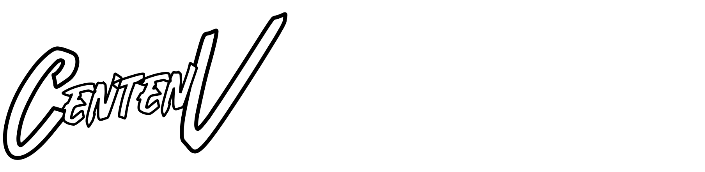

    <picture>
        <source media="(prefers-color-scheme: dark)" srcset="./src/assets/wikilogofull.svg">
        
    </picture>

---

## Description

Welcome to my *Personal Wiki* repository. A personal hub for information as notes and documentation for the open public to reference.

## Issues
Any issues with the writing or factuality of the information? Feel free to create an issue via the repository's issue tab in Github or also [here](https://github.com/CentenV/wiki/issues)

